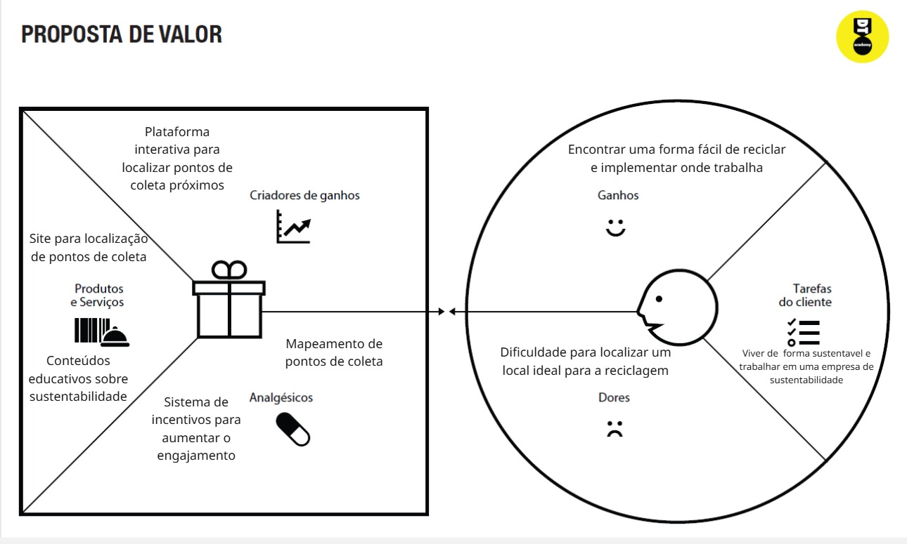
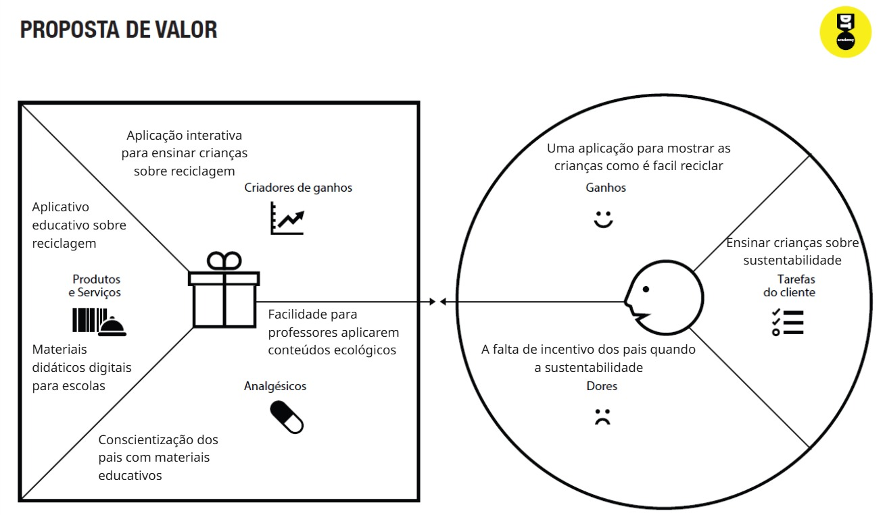
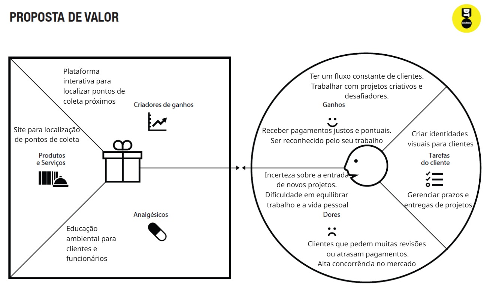

# Product design

Pré-requisitos: <a href="02-Product-discovery.md"> Product discovery</a>

> ⚠️ **APAGUE ESTA PARTE ANTES DE ENTREGAR SEU TRABALHO**

Neste momento, transformam-se os insights e validações obtidos em soluções tangíveis e utilizáveis. Esta fase envolve a definição de uma proposta de valor, detalhando a prioridade de cada ideia, e a consequente criação de wireframes, mockups e protótipos de alta fidelidade, que especificam a interface e a experiência do usuário.

## Histórias de usuários

Com base na análise das personas, foram identificadas as seguintes histórias de usuários:

|EU COMO... `PERSONA`| QUERO/PRECISO ... `FUNCIONALIDADE` |PARA ... `MOTIVO/VALOR`                 |
|--------------------|------------------------------------|----------------------------------------|
|Usuário do sistema  | Registrar minhas tarefas  ⚠️ EXEMPLO ⚠️         | Não esquecer de fazê-las               |
|Administrador       | Alterar permissões        ⚠️ EXEMPLO ⚠️         | Permitir que possam administrar contas |

> ⚠️ **APAGUE ESTA PARTE ANTES DE ENTREGAR SEU TRABALHO**

Apresente aqui as histórias de usuários que são relevantes para o projeto da sua solução. As histórias de usuários consistem em uma ferramenta poderosa para a compreensão e elicitação dos requisitos funcionais e não funcionais da sua aplicação. Se possível, agrupe as histórias de usuários por contexto, para facilitar consultas recorrentes a esta parte do documento.

> **Links úteis**:
> - [Histórias de usuários com exemplos e template](https://www.atlassian.com/br/agile/project-management/user-stories)
> - [Como escrever boas histórias de usuário (user stories)](https://medium.com/vertice/como-escrever-boas-users-stories-hist%C3%B3rias-de-usu%C3%A1rios-b29c75043fac)
> - [User stories: requisitos que humanos entendem](https://www.luiztools.com.br/post/user-stories-descricao-de-requisitos-que-humanos-entendem/)
> - [Histórias de usuários: mais exemplos](https://www.reqview.com/doc/user-stories-example.html)
> - [9 common user story mistakes](https://airfocus.com/blog/user-story-mistakes/)

## Proposta de valor

Propostas de valor:

## Requisitos

As tabelas a seguir apresentam os requisitos funcionais e não funcionais que detalham o escopo do projeto. Para determinar a prioridade dos requisitos, aplique uma técnica de priorização e detalhe como essa técnica foi aplicada.

### Requisitos funcionais

| 001| - O sistema deve permitir que os usuários encontrem pontos de coleta seletiva próximos | ALTA      |
| 002| - A plataforma precisa exibir estatísticas de reciclagem.                              | MÉDIA     |
| 003| - O usuário deve conseguir registrar materiais reciclados e acumular pontos.           | BAIXA     |

### Requisitos não funcionais

| 001| - O site deve ser responsivo e acessível em dispositivos móveis                  | ALTA      |
| 002| - O tempo de resposta para carregamento de mapas deve ser inferior a 3 segundos. | MÉDIA     |
| 003| - O sistema deve estar disponível 24/7.                                          | ALTA      |

## Restrições

|001| O projeto deverá ser entregue até o final do semestre      | ALTA  |
|002| Não é permitido o desenvolvimento de um módulo de back-end | ALTA  |